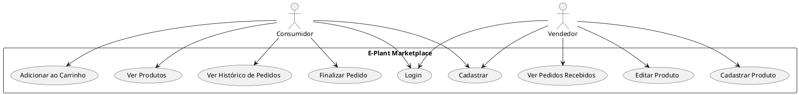
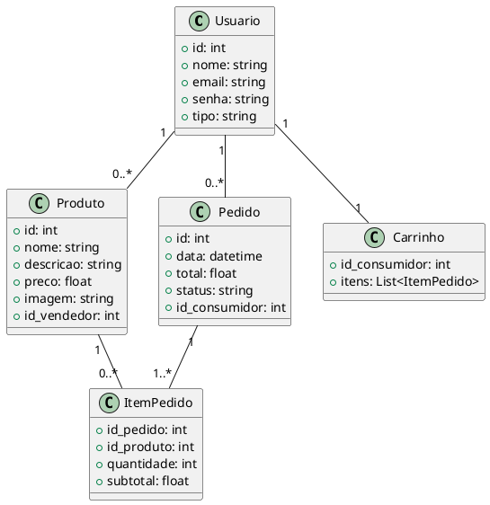
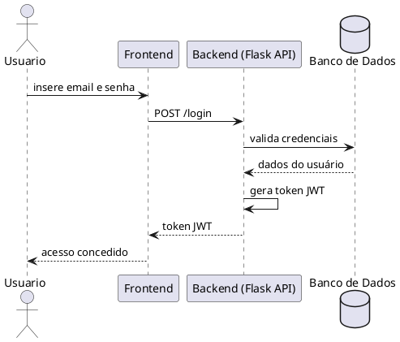
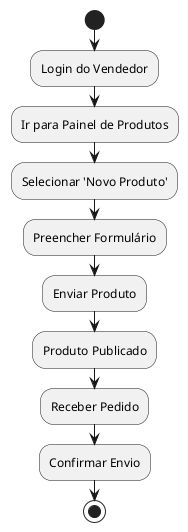

# Documentação de Requisitos e Diagramas - E-Plant

## 🌱 Visão Geral do Projeto

**Nome do Produto:** E-Plant - Marketplace de Plantas e Produtos Naturais

**Objetivo:** Criar uma plataforma digital onde pequenos produtores e artesãos possam vender seus produtos naturais (mudas, terrários, kokedamas, cestas orgânicas) para consumidores finais.

**Público-Alvo:**
- Consumidores interessados em produtos sustentáveis.
- Vendedores autônomos de produtos naturais.

**Diferenciais:**
- Foco em sustentabilidade
- Apoio a pequenos produtores
- Navegação intuitiva e responsiva

**MVP (Produto Mínimo Viável):**
- Cadastro/Login de consumidores e vendedores
- Catálogo de produtos com imagem, descrição e preço
- Carrinho de compras e finalização de pedido
- Painel para vendedores gerenciarem produtos e pedidos
- Histórico de pedidos

## ✅ Requisitos Funcionais

- **RF01**: Cadastro de usuários (nome, email, senha, tipo)
- **RF02**: Login com autenticação JWT
- **RF03**: Visualização de produtos no catálogo
- **RF04**: Adição ao carrinho e checkout
- **RF05**: Histórico de pedidos do consumidor
- **RF06**: Cadastro e edição de produtos pelo vendedor
- **RF07**: Visualização de pedidos recebidos pelo vendedor

## ⚡ Requisitos Não Funcionais

- **RNF01**: Tempo de resposta < 2 segundos
- **RNF02**: Alta disponibilidade (>= 99%)
- **RNF03**: Comunicação criptografada via HTTPS
- **RNF04**: Compatibilidade com navegadores modernos

## 🔎 Modelagem e Diagramas UML

### Diagrama de Casos de Uso

### Diagrama de Classes

### Diagrama de Sequência (Login)

### Diagrama de Atividades (Venda de Produto)

## 📄 Protótipos (Figma)

### Telas do Consumidor:
- Login / Cadastro
- Home com produtos
- Detalhes do produto
- Carrinho / Checkout
- Histórico de pedidos

### Telas do Vendedor:
- Login / Cadastro
- Painel com produtos
- Cadastro / edição de produtos
- Visualização de pedidos

**Design:**
- Paleta: Verdes, marrons e tons naturais
- Tipografia limpa (Inter ou Roboto)
- Layout responsivo com foco em usabilidade

---

> Para mais detalhes, consulte o repositório principal do projeto E-Plant.
